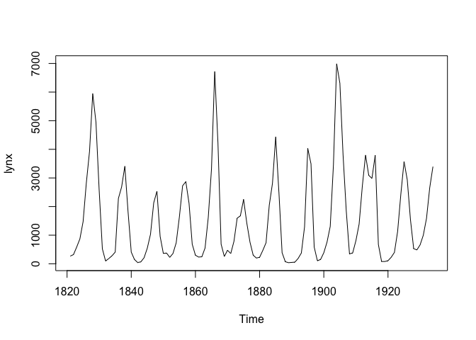
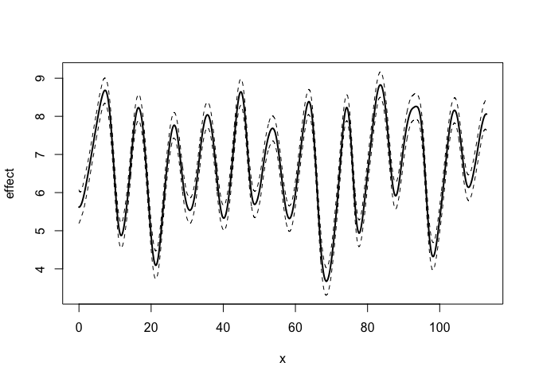
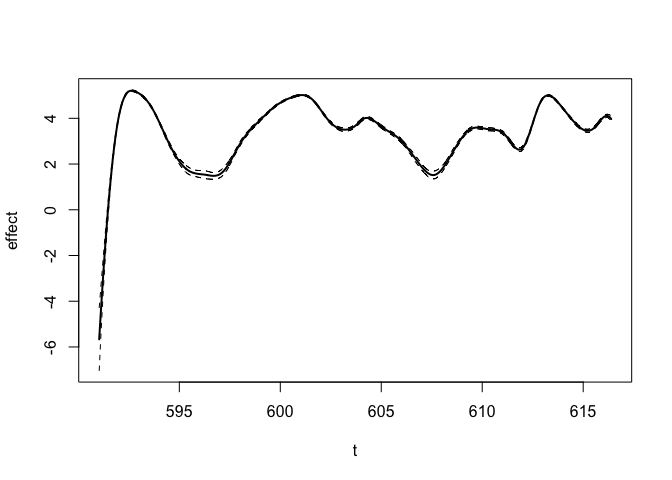
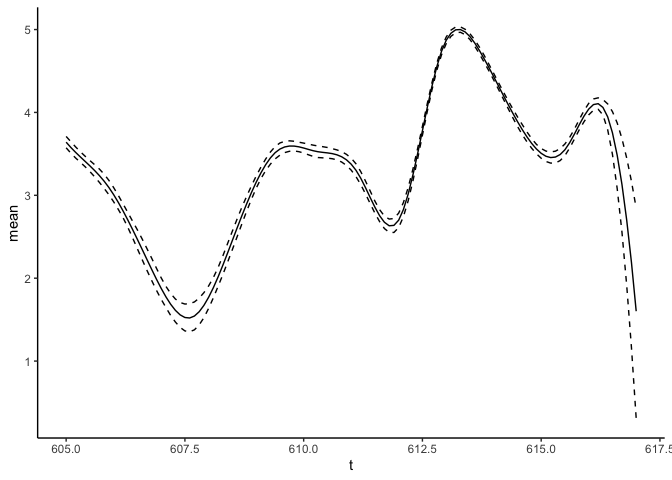
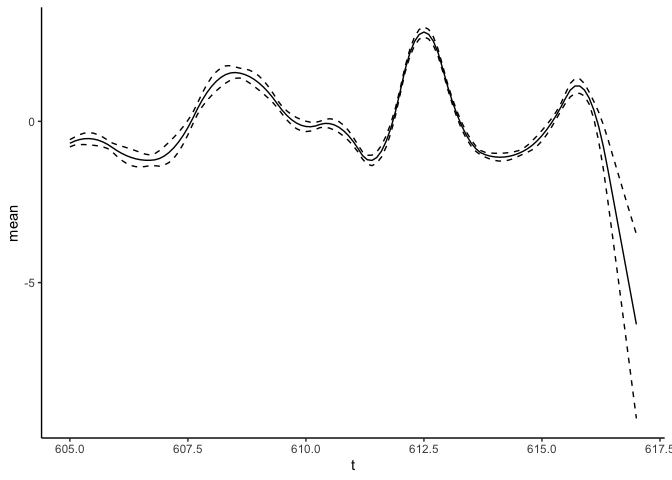
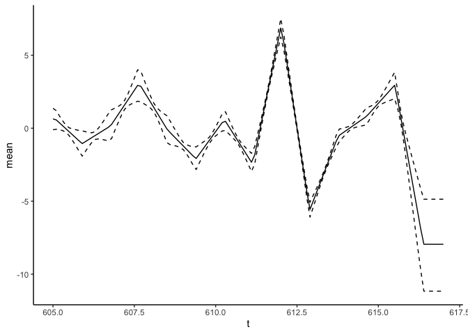

<!-- README.md is generated from README.Rmd. Please edit that file -->

# BayesGP

<!-- badges: start -->
<!-- badges: end -->

The goal of the `BayesGP` package is to efficiently implement
model-based smoothing with flexible GP priors, within a variety of
Bayesian hierarchical models.

## Installation

You can install the development version of BayesGP from
[GitHub](https://github.com/) with:

``` r
# install.packages("devtools")
devtools::install_github("https://github.com/Bayes-GP/BayesGP/tree/development")
```

## Example: sGP

In this example, we will use the `lynx` dataset as an example, which can
be accessed directly from R. Let’s load the dataset and visualize it:

``` r
library(BayesGP)
data <- data.frame(year = seq(1821, 1934, by = 1), y = as.numeric(lynx))
data$x <- data$year - min(data$year)
plot(lynx)
```



Based on a visual examination of the dataset, we can observe an obvious
10-year quasi-periodic behavior in the lynx count with evolving
amplitudes over time. Therefore, we will consider fitting the following
model:

$$
\begin{equation}
    \begin{aligned}
        y_i|\lambda_i &\sim \text{Poisson}(\lambda_i) ,\\
        \log(\lambda_i) &= \eta_i = \beta_0 + g(x_i) + \xi_i,\\
        g &\sim \text{sGP} \bigg(\alpha = \frac{2\pi}{10}, \sigma\bigg),\\
        \xi_i &\sim N(0,\sigma_\xi).
    \end{aligned}
\end{equation}
$$ Here, each $y_i$ represents the lynx count, $x_i$ represents the
number of years since 1821, and $\xi_i$ is an observation-level random
intercept to account for overdispersion effect.

To specify the priors for the sGP boundary conditions and the intercept
parameter, we assume independent normal priors with mean 0 and variance
1000. For the overdispersion parameter $\sigma_\xi$, we assign an
exponential prior with $P(\sigma_\xi > 1) = 0.01$.

To determine the prior for the standard deviation parameter $\sigma$ of
the sGP, we employ the concept of predictive standard deviation (PSD).
We start with an exponential prior on the 50 years PSD:
$$P(\sigma(50)>1) = 0.01.$$

To make inference of the quasi-periodic seasonal effect through the
seasonal-B spline approach, we make use of the `model_fit` function from
`BayesGP`. The prior information of the sGP component should be
specified in `f(.)`. The argument `k = 30` will setup 30 equally spaced
seasonal B-spline basis functions for the approximation. A higher value
of `k` will increase the approximation accuracy of the seasonal B-spline
approximation, at the cost of longer runtime.

By default, the posterior is obtained through an approximation using the
adaptive quadrature method described in the main paper. However, exact
method through MCMC sampling is also possible, by specifying
`method = "MCMC"` in `model_fit`.

``` r
mod <- model_fit(formula = y ~ f(x, model = "sgp", period = 10, k = 30,
                                 sd.prior = list(param = list(u = 1, alpha = 0.01), h = 50),
                                 boundary.prior = list(prec = 0.001)) +
                   f(year, model = "iid", sd.prior = list(param = list(u = 1, alpha = 0.01))),
                 family = "Poisson", data = data, method = "aghq")
```

The posterior summary of the fitted model can be examined through
`summary` or `plot`:

``` r
summary(mod)
#> Here are some posterior/prior summaries for the parameters: 
#>        name median q0.025 q0.975       prior prior:P1 prior:P2
#> 1 intercept  6.687  6.508  6.868      Normal        0    1e+03
#> 2   x (PSD)  2.841  2.230  3.591 Exponential        1    1e-02
#> 3 year (SD)  0.250  0.194  0.325 Exponential        1    1e-02
#> For Normal prior, P1 is its mean and P2 is its variance. 
#> For Exponential prior, prior is specified as P(theta > P1) = P2.
```

``` r
plot(mod)
```



## Example: IWP

This is a basic example which shows you how to use `BayesGP` to fit and
analyze some models, we consider the following data set of COVID-19
mortality in Canada, which is available in the package:

``` r
library(BayesGP)
## basic example code
head(covid_canada)
#>         Date new_deaths        t weekdays1 weekdays2 weekdays3 weekdays4
#> 1 2020-03-01          0 591.0323        -1        -1        -1        -1
#> 2 2020-03-02          0 591.0645         1         0         0         0
#> 3 2020-03-03          0 591.0968         0         1         0         0
#> 4 2020-03-04          0 591.1290         0         0         1         0
#> 5 2020-03-05          0 591.1613         0         0         0         1
#> 6 2020-03-06          0 591.1935         0         0         0         0
#>   weekdays5 weekdays6 index
#> 1        -1        -1     1
#> 2         0         0     2
#> 3         0         0     3
#> 4         0         0     4
#> 5         0         0     5
#> 6         1         0     6
```

We can fit a model with $\text{IWP}_3(\sigma)$ prior using the function
`model_fit`:

``` r
fit_result <- model_fit(new_deaths ~ weekdays1 + weekdays2 + weekdays3 + weekdays4 + weekdays5 + weekdays6 +
                          f(smoothing_var = t, model = "IWP", order = 3, k = 30), 
                        data = covid_canada, method = "aghq", family = "Poisson")
```

We can take a look at the posterior summary of this model:

``` r
summary(fit_result)
#> Here are some posterior/prior summaries for the parameters: 
#>        name median q0.025 q0.975       prior prior:P1 prior:P2
#> 1 intercept  3.668  3.593  3.743      Normal        0    1e+03
#> 2 weekdays1  0.093  0.070  0.117      Normal        0    1e+03
#> 3 weekdays2  0.079  0.055  0.102      Normal        0    1e+03
#> 4 weekdays3  0.127  0.103  0.150      Normal        0    1e+03
#> 5 weekdays4  0.125  0.101  0.149      Normal        0    1e+03
#> 6 weekdays5  0.050  0.025  0.074      Normal        0    1e+03
#> 7 weekdays6 -0.152 -0.178 -0.126      Normal        0    1e+03
#> 8    t (SD)  5.175  4.009  6.940 Exponential        1    5e-01
#> For Normal prior, P1 is its mean and P2 is its variance. 
#> For Exponential prior, prior is specified as P(theta > P1) = P2.
```

We can also see the inferred function $f$:

``` r
plot(fit_result)
```



We can use the `predict` function to obtain the posterior summary of $f$
or its derivative at `new_data`.

For the function $f$:

``` r
library(tidyverse)
#> ── Attaching core tidyverse packages ──────────────────────── tidyverse 2.0.0 ──
#> ✔ dplyr     1.1.3     ✔ readr     2.1.4
#> ✔ forcats   1.0.0     ✔ stringr   1.5.0
#> ✔ ggplot2   3.5.1     ✔ tibble    3.2.1
#> ✔ lubridate 1.9.3     ✔ tidyr     1.3.0
#> ✔ purrr     1.0.2     
#> ── Conflicts ────────────────────────────────────────── tidyverse_conflicts() ──
#> ✖ dplyr::filter() masks stats::filter()
#> ✖ dplyr::lag()    masks stats::lag()
#> ℹ Use the conflicted package (<http://conflicted.r-lib.org/>) to force all conflicts to become errors
predict_f <- predict(fit_result, variable = "t", newdata = data.frame(t = seq(from = 605, to = 617, by = 0.1)))
predict_f %>% ggplot(aes(x = t)) + geom_line(aes(y = mean), lty = "solid") +
  geom_line(aes(y = `q0.025`), lty = "dashed") +
  geom_line(aes(y = `q0.975`), lty = "dashed") +
  theme_classic()
```



For the first derivative:

``` r
predict_f1st <- predict(fit_result, variable = "t", newdata = data.frame(t = seq(from = 605, to = 617, by = 0.1)), deriv = 1)
predict_f1st %>% ggplot(aes(x = t)) + geom_line(aes(y = mean), lty = "solid") +
  geom_line(aes(y = `q0.025`), lty = "dashed") +
  geom_line(aes(y = `q0.975`), lty = "dashed") +
  theme_classic()
```



For the second derivative:

``` r
predict_f2nd <- predict(fit_result, variable = "t", newdata = data.frame(t = seq(from = 605, to = 617, by = 0.1)), deriv = 2)
predict_f2nd %>% ggplot(aes(x = t)) + geom_line(aes(y = mean), lty = "solid") +
  geom_line(aes(y = `q0.025`), lty = "dashed") +
  geom_line(aes(y = `q0.975`), lty = "dashed") +
  theme_classic()
```


